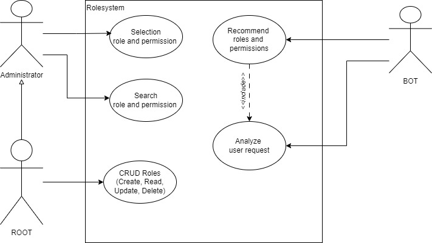
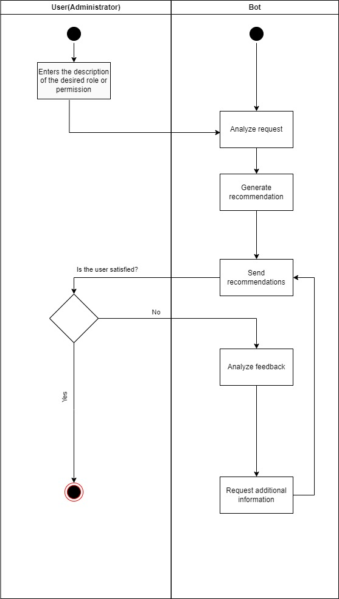

# Role and Permission Recommendation Bot

## Overview

The **Role and Permission Recommendation Bot** is an intelligent system designed to assist users in determining the appropriate roles and permissions based on descriptive queries. With a complex system of approximately permissions and roles, this bot aims to simplify the process of recommending relevant roles and permissions, streamlining user access management.

## Features

- **Natural Language Processing**: Understands and interprets user descriptions to suggest roles and permissions.
- **Dynamic Recommendations**: Provides relevant role and permission suggestions based on system data.
- **User Feedback Integration**: Learns and improves recommendations based on user feedback.
- **Interactive Query Handling**: Engages with users to clarify and refine recommendations.

## Use Cases

### Use Case Diagram

The use case diagram visualizes the interactions between the bot and its users. Key use cases include:

1. **User Requests Recommendation**: The user provides a description of the desired role or permission.
2. **Bot Analyzes Query**: The bot processes the request using its recommendation engine.
3. **Bot Provides Recommendations**: The bot generates and presents suitable roles and permissions to the user.
4. **User Provides Feedback**: The user accepts or rejects the recommendations and provides feedback if necessary.
5. **Bot Refines Recommendations**: Based on feedback, the bot may ask additional questions to improve future recommendations.

### Activity Diagram

The activity diagram illustrates the step-by-step workflow of how the bot processes requests:

1. **Start Interaction**: Begin interaction with the bot.
2. **User Submits Query**: User describes the role or permission they need.
3. **Bot Analyzes Request**:
   - Accesses role and permission system.
   - Processes the query.
4. **Generate Recommendations**:
   - Bot generates a list of relevant roles and permissions.
5. **Present Recommendations**: Bot sends recommendations to the user.
6. **User Feedback**:
   - **If Recommendations Accepted**: Interaction ends successfully.
   - **If Recommendations Rejected**: Bot collects feedback and refines recommendations.
7. **Refine Recommendations**:
   - Bot may ask additional questions to clarify the user’s needs.
   - Repeats recommendation process.
8. **End Interaction**: Concludes interaction based on user feedback.

